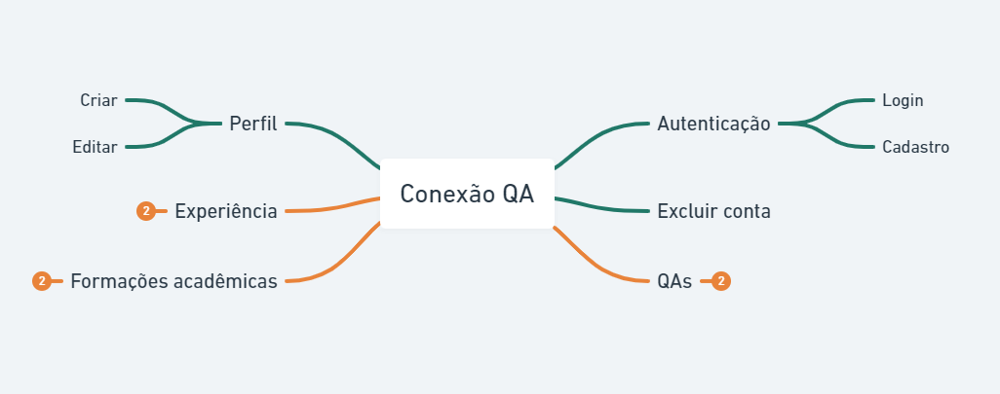

# Desafio Virada da Qualidade ⏳

>Projeto da competição pela categoria `Planejamento de testes` no evento Virada da Qualidade da [Iterasys](https://iterasys.com.br/). O regulamento completo do desafio pode ser visualizado [aqui](https://github.com/virada-qualidade/regulamento)
 `Projeto desenvolvido em 11h`

---
### Tipos de testes 🤖

- E2E: Para os testes end-to-end, foi criado um pdf com o planejamento dos testes, com detalhamento de cenários de testes, massa de dados e evidências.
- API: Para os testes de api, foi criada uma collection no Postman e utilizando a aba `Tests`, foi criado casos de teste. A collection está estruturada com Casos de Teste de sucesso e exceção, cobrindo as funcionalidades do [regulamento](https://github.com/virada-qualidade/regulamento).

---
### Funcionalidades 📍

- [x] Login
- [x] Cadastro
- [x] Criar perfil

---
### Mapa mental das funcionalidades 🔎

  

Para visualização do mapa completo, acesse [aqui](https://whimsical.com/conexao-qa-NUqxr7qUd3sji1d9CHXQey)

---
### Como copiar as collections 💾

- Clonar o repositório: `git clone https://github.com/manuletsgo/virada-da-qualidade.git`
- Adicionar a collection no postman: Importar a collection `ConexaoQA.postman_collection.json`
- Adicionar o ambiente no postman: Importar o ambiente `ConexaoQA.postman_environment.json`

🔴 Para um tutorial detalhado, criei um passo a passo na pasta `public/tutorial`

---
## Apoio 🌟

Mostre seu apoio dando uma 🌟 se esse projeto te ajudou de alguma forma! :)
Futuramente será feito uma refatoração do projeto, com pontos de melhoria e maior cobertura de testes da aplicação [Conexão QA](https://conexaoqa.herokuapp.com/)

---
## 📝 Licença

Copyright © 2021 [Emanuele Amanda Marques](https://github.com/manuletsgo).

Este projeto possui a licença [MIT](https://github.com/manuletsgo/virada-da-qualidade/blob/main/LICENSE).
